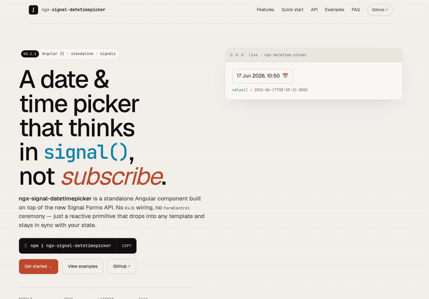

# ngx-signal-datetimepicker

> Open-source Angular datetime picker — date + time in **one control**, powered by **Signal Forms**.

[](https://www.npmjs.com/package/ngx-signal-datetimepicker)
[](./LICENSE)

<p align="center">
  
</p>

This is an Angular workspace that contains:

- `projects/ngx-signal-datetimepicker` — the publishable library
- `projects/demo` — a small demo app showing every usage pattern

> **Why?** The Angular ecosystem doesn't have a small, framework-native datetime picker that exposes one combined `Date | null` value and plugs into the new Signal Forms API. This fixes that.

### Why not `<input type="datetime-local">`?

Native works for prototypes. In real apps you usually need things the browser doesn't give you:

- **Consistent UX** across iOS (wheel), Android (calendar), and desktop browsers
- **Per-app locale** instead of "whatever the user's OS is set to"
- **`Date` in your model**, not an ISO string you have to parse at every boundary
- **Styled / localized validation messages** routed through Signal Forms or Reactive Forms
- **Disabled dates / ranges**, custom triggers, inline mode
- **Full keyboard support on mobile** (Chrome Android still lacks it for `date` inputs)
- **WCAG 2.2 AAA conformance** that doesn't depend on the browser

See the full feature-by-feature comparison in the [library README](./projects/ngx-signal-datetimepicker/README.md#why-not-input-typedatetime-local).

📦 **Package:** [`ngx-signal-datetimepicker`](./projects/ngx-signal-datetimepicker/README.md) — see the library README for full API docs.

## Repo layout

```
.
├── projects/
│   ├── ngx-signal-datetimepicker/   ← library (published to npm)
│   └── demo/                        ← demo app (used for local development)
├── angular.json
├── package.json
└── LICENSE                          ← MIT
```

## Develop locally

```bash
npm install

# Build the library (must run before serving the demo so the path alias resolves)
npm run build:lib

# Run the demo
npm start
```

The library uses [ng-packagr](https://github.com/ng-packagr/ng-packagr); the demo references it via a TypeScript path alias declared in `tsconfig.json`.

## Publish to npm

```bash
# 1. Bump the version inside projects/ngx-signal-datetimepicker/package.json
# 2. Build a fresh dist
npm run build:lib

# 3. Dry-run to check what will be shipped
cd dist/ngx-signal-datetimepicker
npm publish --dry-run

# 4. Publish (you must be logged into npm: `npm login`)
npm publish --access public
```

## Push to GitHub

The repository name suggested in the library `package.json` is `ngx-signal-datetimepicker`. Adjust the URLs there if you fork or rename.

```bash
git init
git add .
git commit -m "Initial commit"
git branch -M main
git remote add origin git@github.com:<your-user>/ngx-signal-datetimepicker.git
git push -u origin main
```

## Contributing

Issues and PRs are welcome. The library is intentionally small — please keep it dependency-free and standards-based.

## License

MIT
